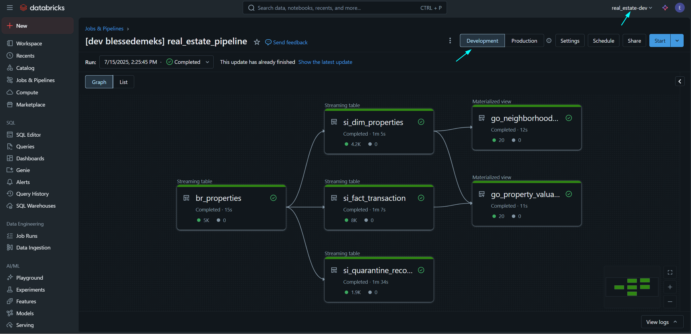
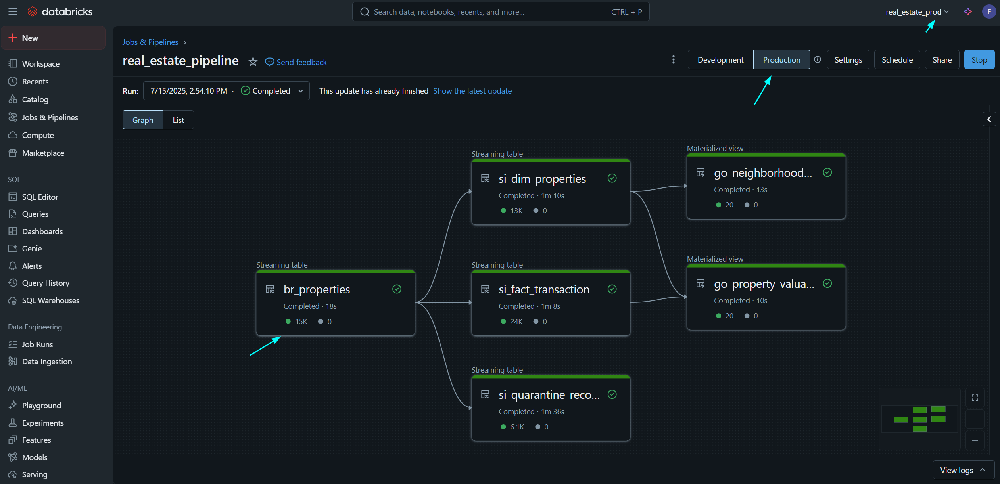

# Step-by-Step Guide to Set Up and Run the Real Estate Pipeline with Databricks Asset Bundles on GCP

## YouTube Playlist

[Watch the full Real Estate Databricks Asset Bundle Series here](https://www.youtube.com/playlist?list=PLs9W2D7jqlTW4eJHY3pyN86IpcVjq30U5)

---

## Table of Contents

- [Part 1: Complete Project Introduction](#part-1-complete-project-introduction)
- [Part 2: Ingest Raw Data Using Autoloader](#part-2-ingest-raw-data-using-autoloader)
- [Part 3: Build the Silver Layer](#part-3-build-the-silver-layer)
- [Part 4: Refine with the Gold Layer](#part-4-refine-with-the-gold-layer)
- [Part 5: Pipeline Configuration Explained](#part-5-pipeline-configuration-explained)
- [Part 6: Develop and Deploy Jobs with Your Pipeline](#part-6-develop-and-deploy-jobs-with-your-pipeline)
- [Part 7: Deploy and Verify in Dev and Prod](#part-7-deploy-and-verify-in-dev-and-prod)
- [Part 8: Unit and Integration Testing](#part-8-unit-and-integration-testing)
- [Part 9: Automate CI/CD with GitHub Actions](#part-9-automate-cicd-with-github-actions)
- [Part 10: Query Data with Natural Language in Unity Using Genie](#part-10-query-data-with-natural-language-in-unity-using-genie)

---

## Project Structure
```bash
real_estate/
├── .github/
│   └── workflows/
│       ├── ci.yml
│       └── cd.yml
├── .gitignore
├── databricks.yml
├── pytest.ini
├── requirements-dev.txt
├── resources/
│   ├── real_estate.job.yml
│   └── real_estate.pipeline.yml
├── src/
│   ├── jobs/
│   │   └── tasks/
│   │       ├── __init__.py
│   │       ├── neighborhood_insight_report.ipynb
│   │       └── property_valuation_update.ipynb
│   └── pipeline/
│       ├── bronze/
│       │   ├── __init__.py
│       │   ├── bronze_properties.py
│       │   ├── bronze_schema.py
│       │   └── main.ipynb
│       ├── silver/
│       │   ├── __init__.py
│       │   ├── silver_properties.py
│       │   ├── silver_schema.py
│       │   ├── silver_validation.py
│       │   └── main.ipynb
│       └── gold/
│           ├── __init__.py
│           ├── gold_properties.py
│           └── main.ipynb
└── tests/
    ├── integration/
    │   └── full_pipeline/
    │       ├── __init__.py
    │       ├── expected_trends.json
    │       ├── expected.json
    │       ├── input.json
    │       └── test_full_pipeline.py
    └── unit/
        ├── bronze/
        │   ├── data/
        │   │   └── bronze_properties/
        │   │       ├── expected_ingest_raw_property_data.json
        │   │       ├── input_ingest_raw_property_data.json
        │   │       └── __init__.py
        │   └── test_bronze_properties.py
        ├── gold/
        │   ├── data/
        │   │   └── gold_properties/
        │   │       ├── expected_aggregate_property_valuations.json
        │   │       ├── expected_build_neighborhood_trends.json
        │   │       ├── input_aggregate_property_valuations_dim.json
        │   │       ├── input_aggregate_property_valuations_fact.json
        │   │       ├── input_build_neighborhood_trends_dim.json
        │   │       └── __init__.py
        │   └── test_gold_properties.py
        └── silver/
            ├── data/
            │   └── silver_properties/
            │       ├── expected_flatten_property_data.json
            │       ├── expected_transform_property_dimensions.json
            │       ├── expected_transform_transaction_facts.json
            │       ├── input_flatten_property_data.json
            │       ├── input_transform_property_dimensions.json
            │       ├── input_transform_transaction_facts.json
            │       ├── additional_fixture_input.json
            │       ├── additional_fixture_expected.json
            │       ├── expected_property_dimensions_structure.json
            │       └── __init__.py
            └── test_silver_properties.py
```

---

## Part 1: Complete Project Introduction

### Introduction to Databricks Asset Bundles with Real Estate Project

Welcome to this demo of the Real Estate Pipeline project. Databricks Asset Bundles provide a way to define, deploy, and manage Databricks resources programmatically using YAML files. This tool streamlines your workflow by centralizing configuration and enabling consistent deployments across environments.

Resources managed by Databricks Asset Bundles include:

- Jobs  
- Pipelines  
- Experiments  
- Dashboards  
- Quality monitors  
- Schemas  
- Models  
- ML models  

In this demo, we use Databricks Asset Bundles to build the Real Estate Pipeline with a medallion architecture:

- Bronze: Stores raw data  
- Silver: Cleans and organizes data  
- Gold: Creates useful summaries  

You will learn:

- How to set up a Databricks workspace and install tools  
- How to use Asset Bundles to build and configure pipeline layers  
- How to set up and run jobs with Asset Bundles  
- How to test all layers effectively  
- How to integrate with GitHub using Asset Bundles  
- How to configure CI/CD workflows with GitHub Actions  

### Subscribe to Databricks on GCP Marketplace

1. Go to the GCP Marketplace  
2. Locate the Databricks tile under Analytics  
3. Use the search bar if needed  
4. Click the tile and select "Subscribe"  
5. Choose a billing account  
6. Accept terms and proceed  
7. Click “Sign up with Databricks”  
8. Enter company name and continue with Google  
9. Authenticate with your Google account  
10. Refresh and click "Manage and Provision"  
11. Log in to your Databricks account  
12. Select trial option and complete setup  

### Create Your First Workspace

1. Click “Create Workspace”  
2. Name your workspace (e.g., real_estate_dev)  
3. Select a region (e.g., europe-west3)  
4. Enter your GCP project ID  
5. Use default VPC settings  
6. Click “Save” and wait for deployment  
7. Confirm “Running” status  
8. Open workspace and log in  
9. Repeat for a second workspace (real_estate_prod)  
10. Note the workspace URLs

```bash
https://2058154152779618.8.gcp.databricks.com  
https://2041293835720014.4.gcp.databricks.com
```

### Installing Tools for Databricks Development

Create a virtual environment and activate it:

On macOS/Linux:
```bash
source venv/bin/activate
```

On Windows:
```bash
venv\Scripts\activate
```

Install the Databricks CLI and authenticate:

Authenticate to Dev Workspace:
```bash
databricks auth login --profile real-estate-dev
``` 

Enter:
```bash
https://2058154152779618.8.gcp.databricks.com
```

Authenticate to Prod Workspace:
```bash
databricks auth login --profile real-estate-prod
```

Enter:
```bash
https://2041293835720014.4.gcp.databricks.com
```

Verify active profiles:
```bash
databricks auth profiles
```

Expected output:
```bash
real-estate-dev https://2058154152779618.8.gcp.databricks.com YES  
real-estate-prod https://2041293835720014.4.gcp.databricks.com YES
```

### Optional Cleanup

Edit the config file if needed:
```bash
code $env:USERPROFILE\.databrickscfg
```

Also check:
```bash
C:\Users\<YourName>\.databricks\token-cache.json
```

Remove expired tokens or unused profiles.

### JDK Setup for Spark

1. Install JDK 8 from Adoptium  
2. Use the MSI installer for Windows x64  
3. Set `JAVA_HOME`  
4. Add bin path to system environment  
5. Verify with terminal version check  

### Initializing the Databricks Asset Bundle and Creating the Project Folder

Choose a built-in template:

| Template Name    | Use Case                          |
|------------------|-----------------------------------|
| default-python   | Notebooks, workflows, DLT         |
| default-sql      | SQL-only projects                 |
| mlops-stacks     | ML lifecycle projects             |
| dbt-sql          | dbt on Databricks                 |

Initialize the bundle:
```bash
databricks bundle init default-python --profile real-estate-dev
```

Explore the generated folder:
```bash
real_estate/
├── databricks.yml
├── src/
│   ├── notebooks/
│   ├── pipelines/
│   └── real_estate/
└── resources/
```

Replace default `bundle.yml` with:
```bash
real_estate/databricks.yml
```

Define host URLs in `databricks.yml` using `targets`. No need to manually pass `DATABRICKS_HOST`.

### Common Setup Errors

- `ModuleNotFoundError: pyspark`: Install required dependency  
- `FileNotFoundError: spark-submit.cmd`: Check Spark CLI and system path  
- `JavaPackage not callable`: Check for mixed JDK and JRE setups  
- `Cannot run program 'python3'`: Add Python path to system environment  
- `FileNotFoundError: input JSON`: Verify input path and file existence  
- `.collect()` hangs: Add logging, isolate logic  
- Spark subprocess issues: Use PowerShell script:

```bash
real_estate/env_vars.ps1
```

---

## Part 2: Ingest Raw Data Using Autoloader

### Building the Bronze Layer in Databricks Asset Bundles

To implement the Bronze Layer in your real estate pipeline, follow the steps below:

1. Inside `src/`, create a folder called `pipeline`  
   Create an empty `__init__.py` file at:  
   [`real_estate/src/pipeline/__init__.py`](src/pipeline/__init__.py)

2. Inside `pipeline/`, create a folder called `bronze`  
   Create an empty `__init__.py` file at:  
   [`real_estate/src/pipeline/bronze/__init__.py`](src/pipeline/bronze/__init__.py)

3. Add the module `bronze_properties.py` in the `bronze/` folder  
   File location:  
   [`real_estate/src/pipeline/bronze/bronze_properties.py`](src/pipeline/bronze/bronze_properties.py)  
   This file defines the `BronzeProcessor` class responsible for ingesting nested JSON files from GCS using Databricks Auto Loader with a predefined schema.

4. Add the notebook `main.ipynb` in the `bronze/` folder  
   File location:  
   [`real_estate/src/pipeline/bronze/main.ipynb`](src/pipeline/bronze/main.ipynb)  
   This notebook initializes the Spark session, constructs the GCS path dynamically using bundle variables, and defines a Delta Live Table for streaming ingestion of raw property data.

Once complete, your Bronze Layer will be capable of reliably ingesting raw data from GCS into Delta format using Auto Loader.

---

## Part 3: Build the Silver Layer

### Building the Silver Layer in Databricks Asset Bundles

To implement the Silver Layer of the pipeline, follow these steps under the `pipeline/` directory.

1. Create a folder named `silver`  
   Add an empty initialization file at:  
   [`real_estate/src/pipeline/silver/__init__.py`](src/pipeline/silver/__init__.py)

2. Add the schema transformation module  
   File location:  
   [`real_estate/src/pipeline/silver/silver_schema.py`](src/pipeline/silver/silver_schema.py)  
   This defines the `PropertySchema` class that flattens nested property data into a structured schema for downstream processing.

3. Add the processing logic module  
   File location:  
   [`real_estate/src/pipeline/silver/silver_properties.py`](src/pipeline/silver/silver_properties.py)  
   This defines the `SilverProcessor` class that transforms input data into fact and dimension tables.

4. Add the validation module  
   File location:  
   [`real_estate/src/pipeline/silver/silver_validation.py`](src/pipeline/silver/silver_validation.py)  
   This defines the `SilverValidator` class that validates incoming data and quarantines problematic records.

5. Add the entry-point notebook  
   File location:  
   [`real_estate/src/pipeline/silver/main.ipynb`](src/pipeline/silver/main.ipynb)  
   This notebook defines Delta Live Tables used for processing validated property transactions and dimensions, along with the quarantine logic.

Your Silver Layer is now capable of transforming raw ingested data into clean, trusted assets structured for analytics and business consumption.

---

## Part 4: Refine with the Gold Layer

### Building the Gold Layer in Databricks Asset Bundles

To implement the Gold Layer of your pipeline, follow these steps under the `pipeline/` directory:

1. Create a folder named `gold`  
   Add an empty initialization file at:  
   [`real_estate/src/pipeline/gold/__init__.py`](src/pipeline/gold/__init__.py)

2. Add the aggregation module  
   File location:  
   [`real_estate/src/pipeline/gold/gold_properties.py`](src/pipeline/gold/gold_properties.py)  
   This defines the `GoldProcessor` class responsible for aggregating property valuations and generating neighborhood insights using business logic tailored for the Gold Layer.

3. Add the entry-point notebook  
   File location:  
   [`real_estate/src/pipeline/gold/main.ipynb`](src/pipeline/gold/main.ipynb)  
   This notebook sets up Delta Live Tables that compute high-level aggregations for valuations and trends across locations, making the data ready for reporting and analytics.

Your Gold Layer is now capable of producing analytics-ready datasets optimized for dashboards, machine learning, and executive summaries.

---

## Part 5: Pipeline Configuration Explained

### Setting Up the Main Configuration File for Databricks Asset Bundles

The central configuration file for this project is:
[`real_estate/databricks.yml`](databricks.yml)

This YAML file defines named targets for different environments (`dev` and `prod`) and sets variables used throughout the pipeline such as GCS paths, catalog, and schema. It allows for consistent behavior across deployment contexts using classic clusters.

- No modifications are needed unless you update the project’s environment targets or add new bundle variables.
- This file also enables environment-specific secrets, workspace host bindings, and Spark configurations.

Why it matters:

- Promotes clean separation between dev and prod setups  
- Ensures safe, repeatable deployments  
- Reduces manual configuration overhead  
- Centralizes logic for execution modes and variable reuse  

### Setting Up the Pipeline Configuration in Databricks Asset Bundles

Create the folder:
[`real_estate/resources/pipeline`](resources/pipeline)

Add the pipeline configuration file:
[`real_estate/resources/pipeline/real_estate.pipeline.yml`](resources/pipeline/real_estate.pipeline.yml)

This YAML file configures the DLT pipeline and includes:

- **Pipeline Name**  
real_estate_pipeline  

- **Catalog and Schema**  
Defined using bundle variables:
```bash
${var.catalog}
${var.schema}
```

- **Cluster Settings**
- Autoscaling between 1 and 2 workers  
- Worker node type: `n2-highmem-2`  
- Set `PREEMPTIBLE_GCP` for cost savings  
- Use `HA` zone for availability  
- Service account:

```bash
  databricks-gcs-reader@real-estate-valuation-463410.iam.gserviceaccount.com
```

- **Cluster Lifecycle**
- Clusters are **ephemeral**  
- DLT pipelines launch clusters only for the job duration  
- Saves cost by avoiding idle workloads  

- **Execution Roles**
- Driver node: Manages execution, assigns tasks  
- Workers: Perform Spark transformations  
- Autoscaling: Databricks automatically scales workers based on workload

- **Notebook Libraries Used**
- Bronze: [`real_estate/src/pipeline/bronze/main.ipynb`](src/pipeline/bronze/main.ipynb)  
- Silver: [`real_estate/src/pipeline/silver/main.ipynb`](src/pipeline/silver/main.ipynb)  
- Gold: [`real_estate/src/pipeline/gold/main.ipynb`](src/pipeline/gold/main.ipynb)

- **Runtime Variables**
The configuration sets variables such as:  

```bash
data_bucket
gcs_prefix
catalog
schema
mode
```

- **PYTHONPATH Setup**
It adjusts `PYTHONPATH` so that modules in the `src/` folder can be imported correctly throughout notebooks and scripts.

This setup ensures your pipeline runs with proper resource allocation, modular logic reuse, and deployment-ready configuration across environments.

---

## Part 6: Develop and Deploy Jobs with Your Pipeline

### Setting Up the Jobs Configuration in Databricks Asset Bundles

Create a folder inside `resources/` named `jobs`:
[`real_estate/resources/jobs`](resources/jobs)

Add the job configuration file:
[`real_estate/resources/jobs/real_estate_jobs.yml`](resources/jobs/real_estate_jobs.yml)

This YAML file defines the periodic jobs with the following settings:

- **Job Name**: `real_estate_jobs`  
- **Schedule**: Runs every 1 day  
- **Notifications**: Sends failure alerts to `blessedemeks@gmail.com`  
- **Tasks**:
  - `neighborhood_insight_report`: Executes the notebook  
    [`real_estate/src/jobs/tasks/neighborhood_insight_report.ipynb`](src/jobs/tasks/neighborhood_insight_report.ipynb)  
    with parameters: `catalog`, `schema`, and `jobs_schema`
  - `property_valuation_update`: Depends on `neighborhood_insight_report` and executes  
    [`real_estate/src/jobs/tasks/property_valuation_update.ipynb`](src/jobs/tasks/property_valuation_update.ipynb)  
    with the same parameters

### Adding Job Task Files in Databricks Real Estate Project

Create the folder structure and initialization files:

- Jobs package init file:  
  [`real_estate/src/jobs/__init__.py`](src/jobs/__init__.py)

- Tasks sub-package init file:  
  [`real_estate/src/jobs/tasks/__init__.py`](src/jobs/tasks/__init__.py)

Add the notebook for generating insights:

- Neighborhood Insight Report notebook:  
  [`real_estate/src/jobs/tasks/neighborhood_insight_report.ipynb`](src/jobs/tasks/neighborhood_insight_report.ipynb)  
  This notebook generates reports using gold-layer trend data to highlight neighborhood performance metrics.

Add the notebook for updating valuations:

- Property Valuation Update notebook:  
  [`real_estate/src/jobs/tasks/property_valuation_update.ipynb`](src/jobs/tasks/property_valuation_update.ipynb)  
  This notebook recalculates property values using refined business rules and updated insights from previous tasks.

This setup allows your pipeline to run recurring analytical jobs and chain dependencies using configuration-only orchestration.

---

## Part 7: Deploy and Verify in Dev and Prod

### Test Pipeline by Deploying and Running in Both Dev and Prod

To test the full pipeline, begin by deploying to the dev environment.

Deploy the pipeline to `real_estate_dev`:
```bash
databricks bundle deploy -t dev
```

Run the pipeline in `real_estate_dev`:
```bash
databricks bundle run -t dev real_estate_pipeline
```

Inspect data in the `dev_real_estate_valuation` schema.

View the lineage graph generated in the dev workspace:




To promote validated data from dev to prod, use Delta’s clone functionality if needed.

Deploy the project to `real_estate_prod`:
```bash
databricks bundle deploy -t prod
```

Run the pipeline in `real_estate_prod`:
```bash
databricks bundle run -t prod real_estate_pipeline
```

Inspect outputs in the `prod_real_estate_valuation` schema.

View the lineage graph generated in the prod workspace:



After verification, shut down clusters via Databricks UI or CLI to avoid extra cost.

### Pipeline Cluster Reference

The pipeline `real_estate_pipeline` uses:
- Cluster size: 1–2 workers
- Node type: `n2-highmem-2`
- Availability: `PREEMPTIBLE_GCP` with `HA` zone
- Configuration file:  
  [`real_estate/resources/pipeline/real_estate.pipeline.yml`](resources/pipeline/real_estate.pipeline.yml)
- Notebooks used:  
  - Bronze: [`real_estate/src/pipeline/bronze/main.ipynb`](src/pipeline/bronze/main.ipynb)  
  - Silver: [`real_estate/src/pipeline/silver/main.ipynb`](src/pipeline/silver/main.ipynb)  
  - Gold: [`real_estate/src/pipeline/gold/main.ipynb`](src/pipeline/gold/main.ipynb)


## Setup Requirements for Production Access

### Set Up Google Cloud Service Account

1. In Google Cloud Console, navigate to **IAM & Admin**  
2. Go to **Service Accounts**  
3. Click **+ CREATE SERVICE ACCOUNT**  
4. Enter a name and description  
5. Click **CREATE** → **CONTINUE** → **DONE**  
6. Copy the service account email from the list view

Example:
```bash
databricks-gcs-reader@real-estate-valuation-463410.iam.gserviceaccount.com
```

This account is linked in:
[`real_estate/resources/pipeline/real_estate.pipeline.yml`](resources/pipeline/real_estate.pipeline.yml)


### Configure Your GCS Bucket

Create a GCS bucket:

1. Go to **Storage** in the Google Cloud Console  
2. Click **CREATE BUCKET**  
3. Choose a globally unique bucket name without underscores  
4. Finalize by clicking **CREATE**

Set bucket permissions:

1. Go to the **Permissions** tab  
2. Click **ADD**  
3. Assign access to the Databricks service account with roles:  
   - **Storage Admin** (full access)  
   - **Storage Object Viewer** (read-only access)  
4. Click **SAVE**


### Configure a Databricks Cluster

While setting up a new cluster or modifying existing:

- Expand **Advanced Options**  
- Set **Google Service Account** field to:
```bash
databricks-gcs-reader@real-estate-valuation-463410.iam.gserviceaccount.com
```

Security best practices:

- Enable **Cluster Access Control**  
- Enable **Notebook Access Control**  
- This combination ensures that only authorized users can access credentials and GCS data

Reference cluster configuration:
[`real_estate/resources/pipeline/real_estate.pipeline.yml`](resources/pipeline/real_estate.pipeline.yml)

Includes:
- Node type: `n2-highmem-2`
- Cost efficiency setting: `PREEMPTIBLE_GCP`
- Availability: High Availability (HA) zone

---

## Part 8: Unit and Integration Testing

### Testing Pipeline Logic with Pytest

Organize your test suite to validate processing and data flow across pipeline stages.


### Unit Tests Setup

Create the main unit test folder:  
[`real_estate/tests/unit/__init__.py`](tests/unit/__init__.py)

Create subfolders for each layer with init files:

- Bronze: [`real_estate/tests/unit/bronze/__init__.py`](tests/unit/bronze/__init__.py)  
- Silver: [`real_estate/tests/unit/silver/__init__.py`](tests/unit/silver/__init__.py)  
- Gold: [`real_estate/tests/unit/gold/__init__.py`](tests/unit/gold/__init__.py)

Add test modules:

- Bronze ingestion:  
  [`real_estate/tests/unit/bronze/test_bronze_processor.py`](tests/unit/bronze/test_bronze_processor.py)

- Silver transformation:  
  [`real_estate/tests/unit/silver/test_silver_processor.py`](tests/unit/silver/test_silver_processor.py)

- Gold aggregation:  
  [`real_estate/tests/unit/gold/test_gold_processor.py`](tests/unit/gold/test_gold_processor.py)


### Integration Tests Setup

Create the integration test folder:  
[`real_estate/tests/integration/__init__.py`](tests/integration/__init__.py)

Create subfolders with init files:

- Bronze to Silver:  
  [`real_estate/tests/integration/bronze_to_silver/__init__.py`](tests/integration/bronze_to_silver/__init__.py)

- Silver to Gold:  
  [`real_estate/tests/integration/silver_to_gold/__init__.py`](tests/integration/silver_to_gold/__init__.py)

- Full Pipeline:  
  [`real_estate/tests/integration/full_pipeline/__init__.py`](tests/integration/full_pipeline/__init__.py)

Add integration tests:

- Bronze → Silver:  
  [`real_estate/tests/integration/bronze_to_silver/test_bronze_to_silver.py`](tests/integration/bronze_to_silver/test_bronze_to_silver.py)

- Silver → Gold:  
  [`real_estate/tests/integration/silver_to_gold/test_silver_to_gold.py`](tests/integration/silver_to_gold/test_silver_to_gold.py)

- End-to-end:  
  [`real_estate/tests/integration/full_pipeline/test_full_pipeline.py`](tests/integration/full_pipeline/test_full_pipeline.py)


### Test Configuration and Execution

Create your test configuration:  
[`real_estate/pytest.ini`](pytest.ini)

Run tests locally from the project root only.

**On Linux/Bash:**
```bash
export PYTHONPATH="$(pwd)/src:$(pwd)/src/pipeline/silver:$(pwd)/src/pipeline/bronze:$(pwd)/src/pipeline/gold" 
pytest
```

**On Windows PowerShell:**
```bash
$env:PYTHONPATH = "$(Get-Location)\real_estate\src" 
pytest
```

Avoid running tests inside subfolders. Stick to the root to ensure correct import resolution.

---

## Part 9: Automate CI/CD with GitHub Actions

### Step-by-Step GitHub Setup Guide

#### 1. Create Your GitHub Repository

- Repository name: `Databricks_Asset_Bundles_Real_Estate_Data_Pipeline`  
- Choose visibility: public or private  
- Do not add README or `.gitignore` at setup — these will be created manually


#### 2. Initialize Locally and Push to GitHub

Use the following Git commands:

```bash
git init
git add .
git commit -m "Initial commit"
git branch -M main
git remote add origin https://github.com/ChuquEmeka/Databricks_Asset_Bundles_Real_Estate_Data_Pipeline.git
git push -u origin main
```


#### 3. Create Development Branch

```bash
git checkout -b dev
git push -u origin dev
```

Use the `dev` branch for CI testing and iterative development.


#### 4. Generate Databricks Personal Access Tokens (PATs)

1. Open your Databricks workspace  
2. Go to your user profile → **User Settings** → **Developer**  
3. Click **Manage** → **Generate New Token**  
4. In your GitHub repository, add two secrets:

```bash
DATABRICKS_DEV_TOKEN     # Used in CI workflow
DATABRICKS_PROD_TOKEN    # Used in CD workflow
```

Secrets are referenced in:

- CI workflow: [`real_estate/.github/workflows/ci.yml`](.github/workflows/ci.yml)  
- CD workflow: [`real_estate/.github/workflows/cd.yml`](.github/workflows/cd.yml)


### Project Configuration Files

#### 5. Define Development Dependencies

Create a requirements file:  
[`real_estate/requirements-dev.txt`](requirements-dev.txt)


#### 6. Add Git Ignore Rules

Create a `.gitignore` file:  
[`real_estate/.gitignore`](.gitignore)


#### 7. GitHub Actions Workflow Directory

Create the workflows folder:  
[`real_estate/.github/workflows`](.github/workflows)

Add the following workflow files:

- CI Workflow: [`real_estate/.github/workflows/ci.yml`](.github/workflows/ci.yml)  
- CD Workflow: [`real_estate/.github/workflows/cd.yml`](.github/workflows/cd.yml)

These define the automated deployment pipelines for dev and prod environments.

---

## Part 10: Query Data with Natural Language in Unity Using Genie

### Exploring Databricks Generative AI Features

Databricks integrates generative AI within the lakehouse architecture to help teams interact with data more intuitively. Unity Catalog and Genie work together to enable natural language querying across structured datasets.

Key capabilities include:

- **Semantic Understanding**  
  Genie learns the domain-specific vocabulary and schema of your data, making searches context-aware.

- **Search and Discovery**  
  Ask questions in plain English and receive accurate answers without writing SQL or navigating schema diagrams.

- **Code Assistance**  
  Get real-time help writing queries, debugging notebooks, and fixing transformation logic using language-based prompts.

- **Documentation and Troubleshooting**  
  Genie can answer configuration questions, suggest code snippets, and guide you through setup issues directly in the workspace.

This unlocks an entirely new mode of exploration where users focus on what they need — not how to ask for it.

---